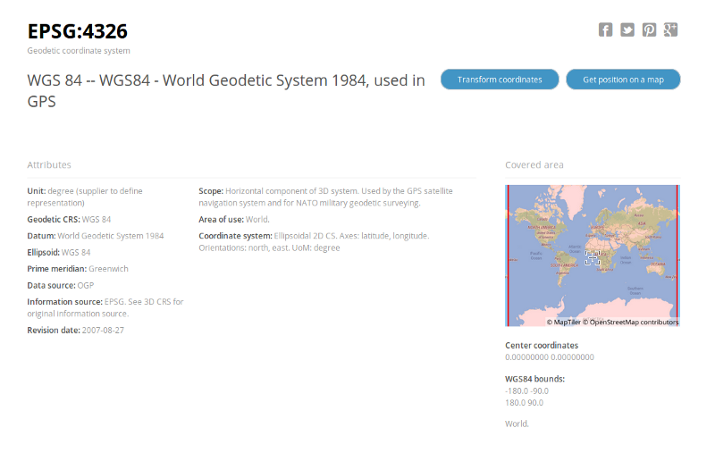

Quand on s’amuse à faire des cartes, tout va bien jusqu’à ce qu’on tombe sur des données en Lambert93 toutes bizarres. Mais enfin pourquoi tout le monde n’utilise pas les coordonnées GPS ? Tu me donnes une latitude + longitude et tout le monde est content !

Parce que c’est plus compliqué que ça. S’il y a un sujet embrouillant, c’est bien ces histoires de référentiels. Après avoir moi-même décortiqué le sujet, je tente une explication.

 on [Unsplash](https://unsplash.com?utm_source=medium&utm_medium=referral)](./asset-1)

Pourquoi a-t-on besoin de coordonnées ? Simplement pour :

-   dessiner des cartes qui représentent notre Terre et les admirer.
-   pouvoir faire correspondre à un jeu de coordonnées un endroit “physique”.

### Tentons pour cela une première approche

La terre ressemble à une sphère.

Elle a donc un centre que je vais utiliser comme **origine**.

Elle tourne sur elle-même selon un axe Nord-Sud, j’y fais donc passer un axe. Puis je prends un plan perpendiculaire à cet axe et qui passe par le centre, c’est l’**équateur**. L’angle que forme un point avec le centre de la Terre et l’équateur, je l’appelle **latitude**.

Puis je prend une ville, Greenwich par exemple. Je fais passer une ligne par les 2 pôles et Greenwich : c’est le méridien 0, le méridien de Greenwich. Il me permet de définir un autre angle : la **longitude**.

C’était pas compliqué : un couple (latitude, longitude) correspondent donc à un point ! Et on n’a pas besoin de CRS ou de je ne sais quoi ?

Mmmh…

### Deux subtilités débarquent

#### 1\. La Terre n’est pas ronde !

Attention hein, je ne suis pas en train de dire qu’elle est plate. Elle est juste un peu aplatie aux pôles à cause de la force centrifuge. Ça ne saute pas aux yeux, mais ce n’est pas une sphère.

Si on regarde d’encore plus près, elle est en fait un peu cabossée de partout. Ici en exagérant énormément ses irrégularités :

**2\. Son axe de rotation n’est pas stable**

La Terre ne tourne pas autour d’un axe [parfaitement fixe](https://fr.wikipedia.org/wiki/P%C3%B4le_Nord#Localisation), la définition du pôle Nord n’est donc pas évidente. L’oscillation principale est nommée [oscillation de Chandler](https://fr.wikipedia.org/wiki/Oscillation_de_Chandler) et a une période de 14 mois.

### Et alors ?

…me direz vous. Créons un comité que l’on appelera par exemple _The International Earth Rotation Service_ ou [IERS](https://en.wikipedia.org/wiki/International_Earth_Rotation_and_Reference_Systems_Service) et laissons les choisir un pôle Nord une bonne fois pour toutes.

Ok, c’est ce qu’ils ont fait. Mais nous avons un autre problème de taille :

**Où est le bas ?**

Drôle de question. Mais imaginons que je veuille savoir à quelle latitude je me trouve. Une méthode classique est de me servir des étoiles : je vais regarder l’angle que fait par exemple l’étoile polaire avec la verticale. Comme elle est à la verticale du pôle Nord, quand je suis au pôle Nord justement, elle est au dessus de ma tête. Et au fur et à mesure que je m’éloigne du pôle Nord, elle est de plus en plus basse dans le ciel.

J’ai donc besoin de calculer un angle par rapport à l’horizontal, je me munie naturellement d’un niveau à bulle. Autrement dit je compte sur la **gravité** pour me montrer le bas.

Oui mais comme nous l’avons vu, la terre n’est pas parfaitement une sphère, ni même une ellipsoïde, elle est cabossée. Et pire que ça, elle a des chaînes de montagne et des fosses sous marines. De plus elle n’est pas homogène dans sa composition. Donc le champ de gravité n’est pas gentiment pointé vers le centre de la Terre, mais varie en intensité et en direction en chaque point de la surface de la Terre.

#### Le géoïde

La surface équipotentielle de gravité s’appelle le géoïde.

Ce que j’ai trouvé de plus clair pour comprendre ce que c’est que le géoïde : si la Terre était uniformément recouverte d’eau et qu’il n’y avait pas de marée, pas de vent, pas de vague, pas de courant, rien, nada, calme plat, et bien la surface de la Terre coïnciderait avec le géoïde.

En tout point la gravité est perpendiculaire à cette surface. Et ce géoïde est bien entendu lui même irrégulier.

> On voit donc le problème : je me fie à la gravité pour calculer ma latitude, mais la gravité n’est pas la même partout. Elle est influencée par plein de choses, une chaîne de montagne proche par exemple.

Dire à quelqu’un que je me situe à un endroit où l’étoile polaire fait un angle de 30° avec le champ de gravité “local” n’est pas pratique. Il faut trouver un truc mieux. Un truc comme…

### Les Coordinate Reference System (CRS)

L’idée est la suivante : on modélise la forme de la Terre par une forme simplifiée que l’on appelle le sphéroïde de référence. On cale cette forme par rapport à la géométrie de la Terre, ce qu’on appelle le Datum. Et on traduit nos latitudes et longitudes **astronomiques** telles que mesurées précédemment en latitude et longitudes **géodésiques**.

> Car voilà le cœur de l’embrouille

Et oui car voilà le cœur de l’embrouille : il existe plusieurs catégories de coordonnées en fonction de la définition du **bas** que l’on aura retenue.

Si une latitude est toujours un angle, celle-ci sera :

**astronomique** lorsque j’aurai pris comme bas le direction de la gravité (muni d’un fil de plomb ou d’un niveau à bulle).

**géodésique** lorsque j’aurai pris comme bas la perpendiculaire à un sphéroïde que j’aurai choisi.

**géocentrique** lorsque j’aurais pris comme bas le direction du centre de masse de la Terre.

> Les coordonnées que l’on manipule couramment sont _toujours_ les coordonnées géodésiques

Les coordonnées que l’on manipule couramment sont _toujours_ les coordonnées **géodésiques**, elles sont donc _toujours_ liées à des hypothèses : quelle forme avons nous choisie pour la Terre et comment nous avons placé cette forme par rapport à la surface de la Terre. Si on change d’hypothèses, un point change de coordonnées.

Petite remarque : aujourd’hui une méthode courante pour déterminer une position se fait grâce aux satellites du réseau GPS. Ces satellites orbitent autour de la Terre et plus précisément autour de son centre de masse. Les coordonnées naturelles pour les satellites sont donc les _géocentriques_. Mais celles-ci sont reconverties en coordonnées géodésiques par nos appareils électroniques.

#### Un CRS à la loupe

Un Coordinate Reference System, ou système géodésique en français ce n’est rien de plus que l’ensemble de ces hypothèses.

C’est un système de référence qui permet d’exprimer des positions au voisinage de la Terre.

Il en existe deux familles :

-   les **GCS** pour Geographic Coordinate System dans lesquels la Terre est modélisée en 3 dimensions.
-   les **PCS** pour Projected Coordinate System dans lesquels la Terre a été projetée sur une surface 2D pour être représentée sur une carte plane.

Un CRS spécifie aussi :

-   son **unité de mesure**. Des angles (latitude, longitude) pour les GCS ou des distances (mètres ou pieds) pour les PCS.
-   la **projection** utilisée dans le cas des PCS.
-   un **sphéroïde de référence** (c’est à dire la géométrie de la Terre retenue)
-   un **datum**, soit l’emplacement et l’orientation du sphéroïde par rapport à la Terre.

#### Pourquoi tant de CRS ?

Historiquement, chaque pays faisait les choses à sa sauce. Il n’y a pas si longtemps, on n’avait aucune idée d’une manière précise de placer le centre de la Terre. On prenait donc un point quelque part sur son territoire, de préférence au centre de celui-ci. On faisait pendre un fil de plomb et on disait : je déclare qu’ici, la direction de la gravité et la perpendiculaire à mon ellipsoïde sont identiques. Puis on choisissait un ellipsoïde pour qu’il suive au plus près la surface de notre territoire. De là on construisait tout un réseau de points de référence dont les coordonnées étaient déduites de manière optique, depuis la surface de la Terre.

Ce type d’approches, plutôt stylées pour l’époque ont donné lieu à la Nouvelle Triangulation Française ou [NTF](https://fr.wikipedia.org/wiki/Nouvelle_triangulation_de_la_France) en France (point fondamental : la croix du Panthéon), ou au [NAD27](https://en.wikipedia.org/wiki/North_American_Datum) aux USA (point fondamental : [Meades Ranch,](https://en.wikipedia.org/wiki/Meades_Ranch_Triangulation_Station) Kansas).

Les ellipsoïdes et datums utilisés n’étaient pas géocentriques, mais à l’époque on ne pouvait faire mieux.

Et puis avec l’avènement des satellites est apparue une nouvelle famille de CRS, basée sur des ellipsoïdes placés très précisément par rapport à la surface de la Terre et dont le centre coïncide précisément avec le centre de la Terre.

[WGS84](https://en.wikipedia.org/wiki/World_Geodetic_System) est le plus connu d’entre eux puisque c’est celui utilisé par le GPS. Il est très précis.

Mais alors pourquoi en utiliser d’autres de nos jours ?

Il existe bien sur des données qui ont été relevées avant l’avènement des GPS. Mais aujourd’hui, pourquoi le référentiel officiel Français est-il le RGF93 et pas le WGS84 ? Pour ne pas faire comme tout le monde ?

> Parce que le monde bouge !

Le RGF93 est compatible avec le ETRS89, un CRS quasiment similaire à celui utilisé par le GPS à ceci près qu’il suit la plaque tectonique eurasienne sur laquelle nous sommes. Laquelle se déplace lentement, d’environ 1cm/an.

Donc dans le CRS WGS84 du GPS, les coordonnées d’un point physique changent au fil des ans. Je note les coordonnées du parvis de Notre-Dame en coordonnées GPS, je reviens dans 100 ans : les coordonnées ont changé ! Mais si je les note en RGF93, elles restent identiques.

### Spatial Reference

Maintenant que l’on sait bien ce qu’est un CRS, on passe à la notion de Spatial Reference. Ce n’est pas très compliqué, un spatial reference c’est un CRS plus quelques autres informations qui permettent de _vraiment_ lever toute ambiguïté. On trouve donc dedans :

-   un CRS
-   la précision avec laquelle on peut exprimer des coordonnées (combien de chiffres après la virgule)
-   des tolérances, comme par exemple la tolérance de grappe ou [cluster tolerance.](http://resources.esri.com/help/9.3/ArcGISDesktop/com/Gp_ToolRef/Environment_Settings/cluster_tolerance.htm)
-   l’aire géographique couverte par le spatial reference (la France, l’Europe, le monde,…)

### SRID

Ces spatial reference, il y en a naturellement beaucoup, on leur donne donc un identifiant appelé SRID.

Il existe plusieurs standards, un des plus connus est le [EPSG](http://www.epsg.org/) (European Petroleum Survey Group).

On lira donc par exemple qu’un jeu de données est en EPSG 4326. EPSG est l’autorité, 4326 est le SRID.

Voici ce que la page [http://epsg.io/4326](http://epsg.io/4326) nous dit tout à propos de ce spatial reference :

L’occasion de voir si maintenant on comprend tout ce que ça raconte.

On y lit donc que ce SRID correspond au spatial Reference WGS84, un geodetic coordinate system (donc 3D), dont l’unité est le degré. Il utilise le CRS “WGS 84”, lui même composé de l’ellipsoïde “WGS 84” et du datum “[World Geodetic System 1984”](http://epsg.io/6326-datum/). De plus il couvre le monde entier.

Merci les gars, vous appelez tout pareil, comment voulez vous qu’on s’y retrouve ??

Allons voir notre bon vieux [Lambert93](https://epsg.io/2154) bien de chez nous :

Ici nous sommes donc sur du Projected coordinate system (2D). Le CRS est le RGF93, lui même composé d’un ellispoïde (GRS 1980) et d’un Datum (Réseau Géodésique Français 1993). Il couvre la France métropolitaine. Voilà qui est plus clair !

### Une remarque

Une question vous vient peut-être à l’esprit : sur Google map ou OpenStreetMap, on voit des coordonnées en latitude, longitude alors que la carte est toute plate. Comme c’est une carte 2D elle devrait avoir une unité en distance, pas en angle ! Pourquoi ?

En réalité, ces services de cartographie en ligne utilisent l’[EPSG 3857](https://epsg.io/3857) qui est bien un projected reference system, donc plat, dont l’unité est le mètre. Mais ces services font sans nous le dire une conversion vers des coordonnées [EPSG 4326,](https://epsg.io/4326) les fameuses coordonnées GPS qui elles sont angulaires.

### The End

J’espère que le sujet vous parait maintenant plus clair.

Comme vous l’avez peut-être remarqué nous n’avons fait qu’évoquer le sujet des projections, qui est finalement distinct des CRS…mais tout aussi intéressant et embrouillant. Peut-être l’objet d’un futur post ?

Si vous avez des questions et remarques, n’hésitez pas à les poster, je ferai de mon mieux pour y répondre !

Quelques liens très utiles pour approfondir le sujet :

-   [http://resources.esri.com/help/9.3/arcgisengine/dotnet/89b720a5-7339-44b0-8b58-0f5bf2843393.htm](http://resources.esri.com/help/9.3/arcgisengine/dotnet/89b720a5-7339-44b0-8b58-0f5bf2843393.htm)
-   [https://www.e-education.psu.edu/geog862/node/1669](https://www.e-education.psu.edu/geog862/node/1669)
