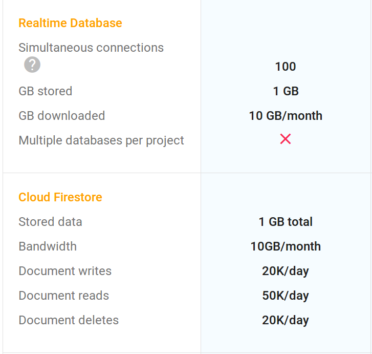

Cet article est un retour d’expérience technique sur la création de [parc-epique.fr](http://parc-epique.fr), une app [open source](https://github.com/fchabouis/parc-epique) (ou une PWA pour être précis) collaborative qui référence toutes les aires de jeux pour enfants de France.


---

### L’objectif

L’objectif était de créer ce [site](https://parc-epique.fr). Une cartographie collaborative de toutes les aires de jeux pour enfants de France, qui permette aux parents de trouver les aires à proximité, d’en voir des photos, de lire les commentaires postés par d’autres parents.

Un projet mignon en somme, bien cadré. On va avoir besoin d’une carte, d’une authentification, de quelques interactions simples (mettre un commentaire, uploader une photo,…). J’ai donc cherché la stack qui me permettrait d’arriver à ce résultat en un minimum de temps.

### La stack technique : qui fait quoi ?

Côté front-end

-   [**Leaflet**](http://leafletjs.com/). On veut une carte, mettre des marqueurs dessus, cliquer sur ces marqueurs et qu’il se _passe des choses_. Leaflet est donc un bon candidat. Il aurait été tout aussi légitime de partir sur [Google maps](https://developers.google.com/maps/).
-   [**Vue.js**](https://vuejs.org/)**.** Ces fameuses choses qui vont se passer, on va les coder en utilisant le framework javascript Vue.js. Assez facile à prendre en main, élégant, je l’aime bien.
-   [**Vuetify**](https://vuetifyjs.com/)**.** Parce qu’on a pas envie de réinventer la poudre pour rendre le tout joli, vuetify nous permet de piocher parmi une belle collection de composants vuejs prêts à être utilisés (liste déroulante, checkbox,…). Et nous facilite la création de notre PWA, comme expliqué plus loin.

Côté back-end

-   **Firebase**. Parce que justement, sur ce coup là je n’avais **_pas_** envie de coder un back-end pour un projet aussi simple que ça. S’authentifier, écrire et lire dans une base, stocker des photos, gérer son serveur. Tout ça est tellement classique qu’on devrait plus avoir à le faire. Firebase promet justement de faire tout ça sans écrire de code.

### On déroule

C’est parti, on se lance. On créé son projet Firebase, la console est facile à prendre en main.

Je veux que mes utilisateurs puissent s’identifier par mail ou via leur compte google ? Clic clic, c’est fait.


Ils oublient leurs mots de passe et veulent le réinitialiser ? C’est firebase qui gère.

La doc est bien faite, donc on arrive rapidement à faire des appels depuis le code javascript du front-end. Je ne vais pas m’attarder dessus, le code est en ligne sur [github](https://github.com/fchabouis/parc-epique), vous pouvez le consulter.

Je vais par contre détailler quelques points particuliers.

### Zoom sur…

-   **Les bases de données Firebase**

Au moment où j’écris cet article (février 2018) Firebase propose deux types de bases de données. L’historique (Real Time Database) et la nouvelle (Cloud Firestore).

Alors laquelle on choisit ?

Avant toute chose, il faut savoir que les bases de données Firebase sont stockées sous forme de JSON. Par exemple :

```
{
  "aires": {
    "aire1": {
      "nom": "jardin Brassaï",
      "nombreDeCommentaires": 3
    },
    "aire2": {
      "nom": "jardin Brassaï",
      "nombreDeCommentaires": 0
    }
  }
}
```

Et que les bases de Firebase sont temps réel. Ce qui est génial.

Imaginons que j’utilise la real time database et que je veuille lire le nombre de commentaire laissés sur l’aire nommée “aire1”.

Je peux soit classiquement lire l’information et puis basta :

```
firebase.database().ref('/aires/aire1/nombreDeCommentaires').once('value').then(function(snapshot) {
  //
  // ici je fais quelque chose avec l'info récupérée
  // 
});
```

Soit je lis l’info en temps réel :

```
firebase.database().ref('/aires/aire1/nombreDeCommentaires').on('value').then(function(snapshot) {
  //
  // ici je fais quelque chose avec l'info récupérée
  // 
});
```

Vous aurez noté le **on** à la place du **once**. Dans ce cas le callback qui est dans le **then** va être appelé une première fois, puis à chaque fois que la variable ‘_nombreDeCommentaires_’ change dans la real time database. Super pratique, car il est du coup facile de faire une app qui réagit instantanément aux changements qui ont lieu dans la base.

Mais…

Les choses se compliquent dès qu’on souhaite poser à la real time database des questions plus complexes. Car celle-ci ne gère pas les agrégations ni les filtres complexes.

Si nous avons par exemple comme base :

```
{
  "notes": [
    {
      "aire": "aire1",
      "note": 4
    },
    {
      "aire": "aire1",
      "note": 3
    },
    {
      "aire": "aire2",
      "note": 2
    }
  ]
}
```

Et que nous posons une question assez simple, du genre : quelle est la note moyenne de aire1 ?

Et bien firebase ne sait pas faire ça.

Il faut donc faire une requête qui va nous renvoyer toutes les notes de aire1, puis calculer la moyenne de ses notes **nous-mêmes** dans le code javascript.

On se retrouve donc à écrire du code dans le front-end qu’on aurait aimé ne pas avoir à écrire. Et on imagine vite des problèmes de perf pointer le bout de leur nez. Car si on a une moyenne de 100 000 notes que va-t-il se passer ? Toutes les notes sont transférées sur l’appareil du client (bof ! ) et le calcul de la moyenne va être fait chez lui (re-bof ! ).

**Cloud Firestore**

Il n’est pas difficile de trouver sur internet beaucoup de gens qui râlent à propos de ces limitations. Firebase, certainement conscient de ces problèmes propose donc autre base de donnée nommée Cloud Firestore et qui permet de construire des requêtes plus complexes.

Mais pour le projet [parc-epique.fr](http://parc-épique.fr), là ou le bât blesse se situe au niveau des [limitations](https://firebase.google.com/pricing/):



Car 50 000 lectures par jour, ça peut paraître beaucoup. Mais j’ai environ 16 000 aires de jeux en base. Si je fais une requête qui les appelle toutes, 4 appels me font 4 x 16 = 64 000 lectures et j’ai dépassé mon quota du jour !

Et comme Firestore ne gère pas les requêtes géographiques (par exemple charge moi les aires à moins de 5km de là ou je me trouve)… ce n’est tout simplement pas utilisable.

Et puisqu’on en parle….

**Les requêtes géographiques avec la Real Time Database**

Heureusement, une libraire js existe pour ce genre de besoins avec la bonne vieille real time database : [GeoFire](https://github.com/firebase/geofire-js/tree/master/examples).

C’est elle qui me permet de ne charger que les aires locales. Et elle marche bien. On n’affiche ici que les aires qui sont dans le cercle jaune.


**Firebase functions : création de miniatures**

Sur parc-epique.fr, les utilisateurs peuvent uploader des photos. Je voulais qu’elles soient visibles sous forme de miniatures pour gagner en fluidité et éviter des transferts inutiles de données.


Comment faire ça avec firebase ?

Via les **functions.** Il est possible de déclencher automatiquement l’exécution de tâches dans firebase. Par exemple, la création d’une miniature lorsqu’une nouvelle photo arrive dans le storage.

Le mieux pour cela est d’aller jeter un coup d’oeil aux [exemples](https://github.com/firebase/functions-samples) mis en ligne par firebase et de s’en inspirer.

**La Progressive Web App**

Un site comme parc-epique.fr est par essence une app, destiné à être consulté sur mobile. Mais pour un projet aussi modeste a-t-on envie d’en faire une application native, téléchargeable sur le Google play store ou l’Apple store ? Clairement pas.

A-t-on envie d’en faire une application hybride avec [Quasar](http://quasar-framework.org/) ou [Ionic](https://ionicframework.com/) ? Encore trop compliqué.

Il existe une voie alternative, relativement méconnue et plus simple : la [PWA](https://developers.google.com/web/progressive-web-apps/).

Si vous allez sur [parc-epique.fr](http://parc-epique.fr) depuis Chrome sur votre mobile, il vous sera automatiquement proposé de l’installer.


Si vous le faites, vous aurez désormais une icône sur votre écran d’accueil et l’app se lancera en plein écran…comme une application classique !

Le plus simple pour suivre cette voie est de se servir du [template](https://vuetifyjs.com/vuetify/quick-start) PWA proposé par vuetify.

Une option vaut la peine d’être considérée.

### Un bilan positif

La stack choisie m’a permis d’obtenir le résultat souhaité en un temps raisonnable. Quelques semaines de travail sur mon temps libre.

Firebase est un outil absolument génial pour la création d’un [MVP](https://en.wikipedia.org/wiki/Minimum_viable_product). Hébergement, sécurité, authentification, déploiement, gestion de la base de données… il fait beaucoup de choses à notre place.

Travailler avec Vuejs a été un plaisir. Ses possibilités de réactivités naturelles ([declarative renderings](https://vuejs.org/v2/guide/#Declarative-Rendering)) couplés aux fonctionnalités temps réel de firebase en font un combo très efficace : les pages se mettent à jour toutes seules !

Partir sur la création d’une PWA plutôt que d’une app traditionnelle est aussi une option qui fait gagner beaucoup de temps…et qui permet d’obtenir d’un coup le site web desktop et le site mobile qui peut se faire passer pour une application. Ce concept a certainement de l’avenir.

Enfin, j’ai été impressionné par la fluidité de Leaflet sur mobile, en particulier avec Chrome. Un des points qui m’inquiétait le plus était la possibilité d’obtenir une carte fluide et réactive sans passer par une app native. Une bonne surprise donc.

Mais attention !

Même un projet aussi simple m’a fait sentir certaines limites :

-   firebase, passé la tranche gratuite devient vite cher.
-   Et il n’est pas facile d’en partir, car tout le code est structuré autour de ses spécificités. Une migration ne s’annonce donc pas triviale.
-   les types de requêtes autorisées par la real time database se limitent aux plus simples. Une application dès qu’elle est un peu complexe risque d’en pâtir fortement. Il est tout de même courant de vouloir filtrer simultanément sur plusieurs critères ou de calculer des agrégations !
-   le base Firestore offre théoriquement plus de possibilités, mais les quota d’utilisation sont plus restreints.
-   Une PWA n’est pas référencée sur un store et perd donc naturellement en visibilité.

Si vous souhaitez rentrer dans les détails, le code est disponible sur [github](https://github.com/fchabouis/parc-epique).

J’espère que ce retour d’expérience vous a été utile. N’hésitez pas à poser des questions au besoin, je ferais de mon mieux pour vous répondre.
